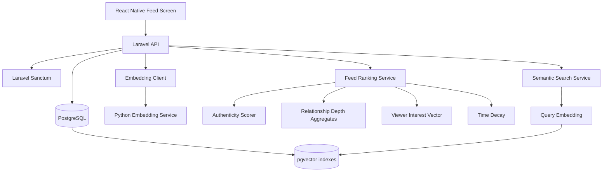

# Technical Solution Document

## Purpose

This document defines the production design for the Guised Up Real Connections
Feed. The goal is a personalized social feed that rewards authentic posts and
real relationships instead of engagement farming.

The implementation target for this submission is:

- Expo React Native feed screen with browser preview
- Laravel API with Sanctum token auth
- PostgreSQL for relational data
- pgvector as the vector database
- Python FastAPI embedding service with deterministic local embeddings
- Docker Compose local runtime
- Queue-backed embedding generation
- Cached feed profile features
- Rate-limited API routes
- Request IDs, structured logs, and operational metrics
- Raw SQL queries for operational analysis

Important product rule:

```text
The feed must not rank posts by likes, shares, or comment volume.
```

Engagement can be logged because it helps understand relationship depth, but it
must not become a popularity score.

Reviewer document map:

- `README.md` explains setup, commands, endpoints, and troubleshooting.
- `docs/PROJECT_EXPLANATION.md` explains the business problem in plain English.
- `docs/TSD.md` is the technical design and trade-off document.
- `docs/ENGINEERING_REVIEW.md` is the senior-review note with trade-offs,
  failure modes, and production hardening plan.
- `docs/WALKTHROUGH.md` is the reviewer runbook with fresh rebuild,
  verification, and UI commands.
- `sql/queries.sql` contains the raw SQL challenge answers.

## Architecture



Local runtime:

```text
Expo React Native / Web
-> Laravel API on http://localhost:8000/api
-> PostgreSQL + pgvector on postgres:5432
-> Python embedding service on http://embedding:8080
```

Local debugging ports:

| Service | URL |
|---|---|
| Laravel API index | `http://localhost:8000/api` |
| Laravel root redirect | `http://localhost:8000 -> /api` |
| Laravel metrics | `http://localhost:8000/api/metrics` |
| Embedding service docs | `http://localhost:18080/docs` |
| Expo Web | `http://localhost:8081` or the port Expo prints |

Repository implementation map:

| Area | Path |
|---|---|
| API routes | `routes/api.php`, `routes/web.php` |
| Feed ranking | `app/Services/Feed/` |
| Embedding client and vector formatting | `app/Services/Embeddings/` |
| Queue job for post embeddings | `app/Jobs/GeneratePostEmbedding.php` |
| Python embedding service | `embedding/src/embedding/main.py` |
| Embedding Poetry project | `embedding/pyproject.toml`, `embedding/poetry.lock` |
| React Native screen | `mobile/src/screens/FeedScreen.tsx` |
| SQL answers | `sql/queries.sql` |

Production direction:

```text
mobile app
-> API gateway / WAF
-> Laravel API containers
-> managed PostgreSQL with pgvector
-> embedding workers/service
-> observability, queues, and rate limits
```

## Database Schema

### users

Laravel user table with Sanctum support.

| Column | Type | Notes |
|---|---|---|
| id | bigint primary key | Stable user identifier |
| name | varchar | Display name |
| username | varchar unique | Public handle |
| email | varchar unique | Login identity |
| password | varchar | Hashed password |
| timestamps | timestamp | Created and updated time |

Indexes:

- `users_email_unique`
- `users_username_unique`

### personal_access_tokens

Sanctum token table.

Indexes:

- unique token index
- morph index on tokenable type and id

### posts

| Column | Type | Notes |
|---|---|---|
| id | bigint primary key | Post identifier |
| author_id | foreign key | References users |
| body | text | User post text |
| image_url | varchar nullable | Optional image URL |
| image_filter_score | decimal | Heuristic signal, higher means less filtered |
| text_genuineness_score | decimal | Heuristic signal from copy style |
| authenticity_score | decimal | Combined score used by feed |
| metadata | jsonb nullable | Future image/model metadata |
| timestamps | timestamp | Created and updated time |

Indexes:

- `(author_id, created_at)`
- `(authenticity_score, created_at)`
- `created_at`

### post_embeddings

| Column | Type | Notes |
|---|---|---|
| id | bigint primary key | Embedding row |
| post_id | foreign key unique | One active embedding per post |
| embedding | vector(384) | pgvector cosine search |
| dimensions | smallint | Embedding dimension |
| model | varchar | Model name/version |
| version | integer | Embedding version |
| timestamps | timestamp | Created and updated time |

Indexes:

- unique `post_id`
- HNSW index on `embedding vector_cosine_ops`

### interactions

| Column | Type | Notes |
|---|---|---|
| id | bigint primary key | Interaction event |
| actor_id | foreign key | User who interacted |
| post_id | foreign key | Target post |
| target_author_id | foreign key | Denormalized post author |
| type | varchar | `view`, `reply`, or `reaction` |
| weight | decimal | Relationship-depth weight |
| metadata | jsonb nullable | Client or event metadata |
| timestamps | timestamp | Created and updated time |

Indexes:

- `(actor_id, target_author_id, created_at)`
- `(post_id, type, created_at)`
- `(actor_id, created_at)`

## Vector DB Decision

I chose pgvector for this take-home.

Reasons:

- It keeps SQL data and vector data in one reproducible database.
- Migrations can create the extension, vector columns, and HNSW index.
- It avoids needing Pinecone, Weaviate, or Qdrant accounts during review.
- It is good enough for this feature size and easy to move behind a repository
  layer later.

Production trade-off:

- pgvector is a strong default while the product is early.
- If feed/search traffic grows independently from transactional writes, the
  vector search path can move to Qdrant or Pinecone without changing API
  contracts.

## Embeddings

The API calls a Python embedding service located at `embedding/`.

```text
POST /v1/embed
{
  "texts": ["funny travel stories from last week"],
  "dimensions": 384
}
```

Local Docker URL:

```text
http://embedding:8080/v1/embed
```

Local debug docs:

```text
http://localhost:18080/docs
```

The service defaults to deterministic hash embeddings. This is intentional for
the assignment because it makes the repo run without API credits and keeps tests
stable.

The same `/v1/embed` contract also supports hosted embedding providers:

| Provider | Required Key | Notes |
|----------|--------------|-------|
| `hash` | None | Default deterministic local provider for review |
| `gemini` | `GEMINI_API_KEY` | Good free-tier option for realistic semantic vectors |
| `cohere` | `COHERE_API_KEY` | Good trial/free option; `embed-english-light-v3.0` is 384-dimensional |
| `openai` | `OPENAI_API_KEY` | Hosted production-grade embedding provider |

Gemini example:

```env
EMBEDDING_PROVIDER=gemini
FEED_EMBEDDING_MODEL=gemini-embedding-001
GEMINI_API_KEY=...
GEMINI_EMBEDDING_MODEL=gemini-embedding-001
```

Cohere example:

```env
EMBEDDING_PROVIDER=cohere
FEED_EMBEDDING_MODEL=embed-english-light-v3.0
COHERE_API_KEY=...
COHERE_EMBEDDING_MODEL=embed-english-light-v3.0
```

OpenAI example:

```env
EMBEDDING_PROVIDER=openai
FEED_EMBEDDING_MODEL=text-embedding-3-small
OPENAI_API_KEY=...
OPENAI_EMBEDDING_MODEL=text-embedding-3-small
```

The default remains `EMBEDDING_PROVIDER=hash` so review does not require paid
credentials.

Groq is not used for embeddings in this submission. Groq's public API is useful
for fast chat/responses inference, but feed ranking needs a text-to-vector
embedding endpoint. This project keeps Groq out of the embedding path to avoid
pretending that a chat model is a vector model.

The embedding service is internal to the backend. Mobile clients never call it
directly. Laravel sends `X-Embedding-Service-Token` for service-to-service
authentication, while end-user authentication stays on the Laravel API via
Sanctum.

Local Python development uses Poetry:

```bash
cd embedding
poetry install
poetry run pytest -q
```

Docker still installs the service as a package with `pip install .`, so the
container runtime does not depend on a host Poetry environment.

Production swap:

- Use Gemini, Cohere, OpenAI, or a local `sentence-transformers/all-MiniLM-L6-v2`
  model behind the same HTTP contract.
- Store `model`, `dimensions`, and `version` with every vector so re-embedding
  can happen safely.
- Rebuild HNSW indexes after a major embedding model migration.

## API Design

All protected endpoints use:

```text
Authorization: Bearer <sanctum-token>
```

### GET /api

Public API index used by reviewers to confirm the backend is up.

Response:

```json
{
  "name": "Guised Up Feed",
  "status": "ok",
  "auth": "Use POST /api/auth/login to create a Sanctum Bearer token.",
  "endpoints": [
    "POST /api/auth/login",
    "GET /api/feed",
    "GET /api/search?q=funny%20travel%20stories",
    "POST /api/posts",
    "POST /api/interactions"
  ]
}
```

### POST /api/auth/login

Request:

```json
{
  "email": "mithlesh@example.com",
  "password": "password"
}
```

Response:

```json
{
  "token": "plain-text-sanctum-token",
  "token_type": "Bearer",
  "user": {
    "id": 1,
    "name": "Mithlesh Upadhyay",
    "username": "mithlesh"
  }
}
```

### GET /api/me

Response:

```json
{
  "data": {
    "id": 1,
    "name": "Mithlesh Upadhyay",
    "username": "mithlesh"
  }
}
```

### POST /api/posts

Request:

```json
{
  "text": "Unfiltered walk through Old Delhi today. Got lost, found the best chai.",
  "image_url": "https://example.com/chai.jpg"
}
```

Response:

```json
{
  "data": {
    "id": 10,
    "text": "...",
    "image_url": "...",
    "authenticity_score": 0.82,
    "author": {
      "id": 1,
      "name": "Mithlesh Upadhyay",
      "username": "mithlesh"
    },
    "created_at": "2026-06-30T10:00:00Z"
  }
}
```

Post creation queues `GeneratePostEmbedding`. With `QUEUE_CONNECTION=sync`, this
runs immediately for local review. With `QUEUE_CONNECTION=database`, a separate
worker can process embeddings asynchronously:

```bash
docker compose exec api php artisan queue:work --queue=embeddings,default
```

### GET /api/feed?page=1

Response:

```json
{
  "data": [
    {
      "id": 10,
      "text": "...",
      "author": {},
      "authenticity_score": 0.82,
      "relationship_score": 0.64,
      "semantic_score": 0.71,
      "time_decay_score": 0.94,
      "feed_score": 0.77
    }
  ],
  "meta": {
    "current_page": 1,
    "per_page": 20,
    "total": 143,
    "last_page": 8
  }
}
```

### GET /api/metrics

Protected operational endpoint for reviewer-visible counters.

Response:

```json
{
  "generated_at": "2026-07-01T03:30:00.000000Z",
  "feed": {
    "users": 3,
    "posts": 12,
    "post_embeddings": 12,
    "posts_waiting_for_embedding": 0,
    "interactions": 40
  },
  "runtime": {
    "queue_connection": "sync",
    "cache_store": "database",
    "embedding_model": "hash-embedding-v1",
    "embedding_dimensions": 384
  }
}
```

### GET /api/search?q={query}

Response:

```json
{
  "data": [
    {
      "id": 10,
      "text": "...",
      "semantic_score": 0.83
    }
  ]
}
```

### POST /api/interactions

Request:

```json
{
  "post_id": 10,
  "type": "reaction",
  "metadata": {
    "reaction": "heart"
  }
}
```

Response:

```json
{
  "data": {
    "id": 55,
    "post_id": 10,
    "type": "reaction",
    "weight": 0.6
  }
}
```

## Feed Ranking Logic

Plain English:

1. Start with recent candidate posts from users other than the viewer.
2. Score authenticity from text and image heuristics. Less polished and more
   personal content scores higher.
3. Score relationship depth from the viewer's genuine interactions with each
   post author. Replies count more than reactions, reactions count more than
   views.
4. Build a viewer interest vector from posts the viewer interacted with
   recently.
5. Cache the viewer interest vector and relationship scores for a short TTL.
6. Compare each candidate post vector with the viewer interest vector.
7. Apply time decay so very old content falls down unless relationship and
   semantic relevance are strong.
8. Combine the signals with fixed weights.
9. Return a paginated feed sorted by this score.

Signal weights:

| Signal | Weight |
|---|---:|
| Relationship depth | 0.35 |
| Authenticity | 0.30 |
| Semantic similarity | 0.25 |
| Time decay | 0.10 |

Pseudocode:

```text
viewer_vector = weighted_average(
    embeddings of posts viewer interacted with in last 60 days,
    weight = interaction_weight * recency_decay
)

relationship_score_by_author = aggregate interactions
    where actor_id = viewer.id
    group by target_author_id
    normalize with log scale

candidate_posts = posts created in last 30 days
    excluding viewer's own posts
    eager load author and embedding

for each post in candidate_posts:
    authenticity = post.authenticity_score
    relationship = relationship_score_by_author[post.author_id] or 0
    semantic = cosine_similarity(viewer_vector, post.embedding) or neutral 0.5
    time_decay = exp(-age_hours / 72)

    score =
        0.35 * relationship +
        0.30 * authenticity +
        0.25 * semantic +
        0.10 * time_decay

sort by score desc, created_at desc
paginate 20 per page
```

## Search Logic

Search embeds the natural-language query and uses pgvector cosine distance:

```sql
ORDER BY post_embeddings.embedding <=> CAST(:query_embedding AS vector)
LIMIT 10
```

This returns semantic matches instead of keyword matches. Time filters like
"last week" are not fully parsed in this submission; the next production
iteration would add query parsing for temporal constraints before vector search.

## Authentication Strategy

Laravel Sanctum is used for token-based API access.

- Seeded users can call `/api/auth/login`.
- The mobile app stores the returned token and sends it as a Bearer token.
- The Python embedding service is not a public user API. It is called only by
  Laravel over the Docker service network and protected with a shared service
  token for local service-to-service authentication.
- In production, token issuance should be rate-limited and protected with
  device/session metadata.

Rate limits are configured per route family:

| Limiter | Default |
|---|---:|
| Login | 10 requests/minute per IP |
| Read APIs | 120 requests/minute per user |
| Write APIs | 30 requests/minute per user |

Every API response includes `X-Request-ID`, and request start/completion logs
include the same ID so a reviewer can trace a request through the API logs.

## Reviewer Validation

Backend stack:

```bash
cp .env.example .env
docker compose up -d --build
docker compose ps
curl http://localhost:8000/api
```

Create a demo token:

```bash
TOKEN=$(curl -s -X POST http://localhost:8000/api/auth/login \
  -H "Content-Type: application/json" \
  -d '{"email":"mithlesh@example.com","password":"password"}' \
  | python3 -c 'import json,sys; print(json.load(sys.stdin)["token"])')
```

Run checks:

```bash
docker compose exec -T api php artisan test
(cd embedding && poetry install && poetry run pytest -q)
(cd mobile && npm run typecheck)
```

Check metrics:

```bash
curl -s http://localhost:8000/api/metrics \
  -H "Authorization: Bearer $TOKEN"
```

Run browser preview:

```bash
cd mobile
EXPO_PUBLIC_API_URL=http://localhost:8000/api EXPO_PUBLIC_AUTH_TOKEN="$TOKEN" npm run web
```

## Trade-Offs And Assumptions

- Hash embeddings are used for reproducibility. The embedding service contract
  is intentionally model-agnostic so this can be switched to OpenAI, Gemini,
  Cohere, or another provider by environment variable.
- Post embedding generation runs through Laravel jobs. The local default queue
  is `sync` for reviewer simplicity; production should run database/Redis queue
  workers separately.
- Viewer interest vectors and relationship aggregates are cached with short TTLs
  to reduce repeat feed-request cost.
- Authenticity scoring is heuristic because image files are not uploaded in the
  API, only image URLs. A production version would use image metadata and a
  lightweight model to detect filters, beauty effects, screenshots, and stock
  content.
- The feed ranks a bounded recent candidate set in application code. For larger
  scale, candidate generation should move into SQL/vector queries and ranking
  should use precomputed features.
- Interaction events are append-only. This gives auditability and supports
  better ranking experiments later.

## AI Agentic Tool Usage

I used Codex as the agentic coding assistant for:

- Reading and summarizing the take-home brief from the provided PDF/text.
- Comparing the implementation style with my existing `agentic_rag` project.
- Generating the Laravel, Python, React Native, SQL, and documentation files.
- Checking consistency between API contracts, migrations, tests, and README.

I made the architecture decisions explicitly:

- pgvector over external vector DBs for reproducible review.
- Python embedding service with hash fallback because API credits should not be
  required.
- Laravel Sanctum token auth because it is required by the brief.
- Relationship/authenticity/semantic/time scoring because popularity ranking
  would violate the product brief.
